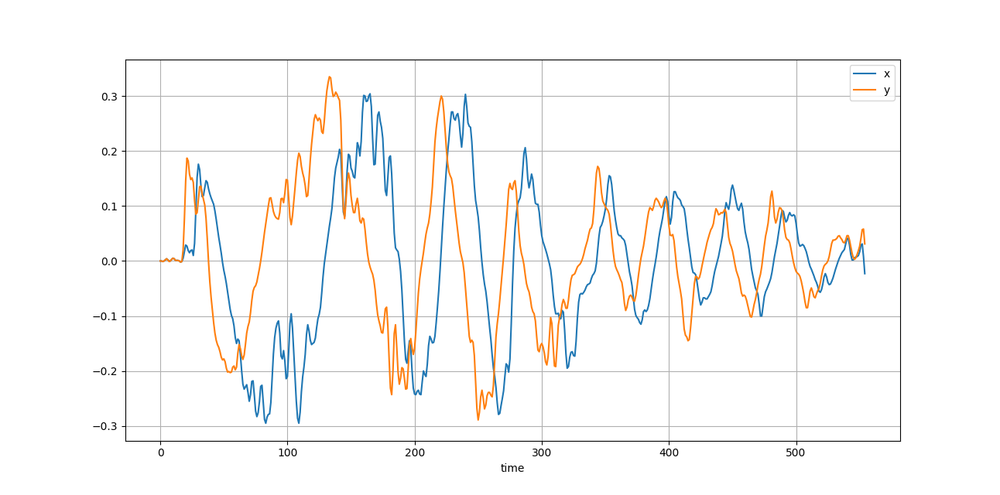

A basic dual-phase lockin implementation for a 2in/2out sound card or audio interface using pyaudio. Tested on a MOTU M2 at 32bits/48kHz sample rate under ALSA.

Connect CH1 OUT to CH1 IN through a loopback wire and set gains appropriately. CH2 OUT should be the input to the DUT and CH2 IN should be the output of the DUT.

Example output file is `log_movemic.txt`. This was a simple experiment in which CH2 OUT was connected to a speaker, and CH2 IN connected to a microphone. The microphone was moved away from the speaker at a near-constant rate, and the resulting zero-crossings in the logfile occur when the reference signal and input are out of phase. The physical distance the microphone moves between zeroes provides the speed of sound.

Current problems: 
1. Processing loop is too slow for >48kHz
2. Generally unpolished
3. Move to sounddevice?
